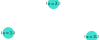
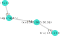

# GraphStorage

[](https://SebastianM-C.github.io/GraphStorage.jl/stable)
[](https://SebastianM-C.github.io/GraphStorage.jl/latest)
[](https://travis-ci.com/SebastianM-C/GraphStorage.jl)
[](https://ci.appveyor.com/project/SebastianM-C/GraphStorage-jl)
[](https://codecov.io/gh/SebastianM-C/GraphStorage.jl)

This is an _experimental_ package for storing hierarchical data in graphs.

### Introduction

In general a graph is a collection of objects with some relations between them.
If we describe the graph from a mathematical point of view, the objects correspond
to vertices and the relations to edges. Graphs can be represented by diagrams.
For example:

|                 Simple graph            |        Simple directed graph
:----------------------------------------:|:-------------------------------------------:
 | 

If the vertices have a direction, we call them directed graphs. We can use graphs
to store data. To do this we will use a graph and associate metadata to the vertices
and the edges. Each vertex will contain a data point and each edge will have an
id, so that we know how data points are connected. We will call a node a vertex
and its associated metadata and a path will be the collection of all edges with
the same id. For example if we have `x = [1, 2, 3]`, then the graph looks like this:



Now, let's consider that we have a function, say `f(x) = x^2`, and we apply it
to our `x` and want to store the resulting `y = [1, 4, 9]`. We encode
the fact that `y` was derived / computed from `x` by using edges
oriented from the `x` nodes to the `y` nodes. We can compare the
graph and the table representations


|  id   |   x   |   y   |
|-------|-------|-------|
|   1   |   1   |   1   |
|   2   |   2   |   4   |
|   3   |   3   |   9   |

We can see that a row in the table corresponds to a path in the graph and a column
in the table would be the collection of nodes with the same keys.

### Implementation

In this package we use `NamedTuple`s to specify the information contained in the nodes.
If we want to add more than one value corresponding to the same name (or symbol),
we can specify the values as a vector. For example, for generating the above graph
we can use:

```julia
using MetaGraphs, GraphStorage

g = MetaDiGraph()
indexby(g, :x)
indexby(g, :y)
add_derived_values!(g, (x=[1,2,3],), (y=[1,4,9],))
```

Note: `NamedTuple`s with a single element must use a comma.
(`(a=1,)` is not the same as `(a=1)`)

This package used a `MetaDiGraph` from [MetaGraphs.jl](https://github.com/JuliaGraphs/MetaGraphs.jl)
for the graph and metadata. The metadata is stored in dictionaries with the keys
being given by vertices or edges. There are two ways of querying the data in the
graph: by using indexing and by using the relationships with other nodes.

- For the first kind, we must use `indexby(g, :name)` before adding any node identified
by `:name`. This will create an entry in the metaindices of the graph, which is
a dictionary that maps the stored values to the vertex indices. As an example,
to access all the nodes with the name `x` in the above graph we can use
`keys(g[:x])`.

- The other way of accessing the data would be by relying on the structure of
the graph. For example we can get the vertex indices of all the neighbors of
a node and use that to get the values. This would be equivalent with a query
based on the parent node. This is useful with more complicated graph structures,
so an example will be provided later.

## Tutorial and motivation

Let us consider that we have some simulation data with the following structure:
* simulation parameters: `P`  which takes a value or each simulation.
* initial conditions: for each `P` we have an algorithm that generates some
initial conditions. The algorithm itself may have parameters.
* simulation results: for each initial conditions the simulation produces some results
(we can think of this as being a function of the initial conditions as illustrated
in the Introduction).

We will now progressively build up the graph. Let's say that the first simulation
has `P=1` and using `"alg1"` we generated some initial conditions (`x`).

```julia
using LightGraphs, MetaGraphs
using GraphStorage

g = MetaDiGraph()
indexby(g, :P)

# We can add the nodes one by one
add_nodes!(g, (P=1,)=>(alg="alg1",))
# or in bulk
add_bulk!(g, (P=1,)=>(alg="alg1",), (x=[10., 20., 30.],))
```
Up to this point the graph looks like this:


For the initial conditions we used a node for the algorithm (containing the name)
and one for each of the produced values. Next, we will obtain our simulation results
and add them to the graph.
```julia
x = keys(g[:x]) # retrieve the previously stored initial conditions
results = simulation(x)
add_derived_values!(g, ((P=1,),(alg="alg1",)), (x=x,), (r=results,))
```

Then adding initial conditions would look like this:
```julia
dep = (A=1,)=>(D=0.4,)=>(B=0.55,)=>(E=10.,)=>(ic_alg=FirstAlg(2),)
q₀, q₂ = initial_conditions(FirstAlg(2))
add_bulk!(g, dep, (q₀=q₀, q₂=q₂))

dep = (A=1,)=>(D=0.4,)=>(B=0.5,)=>(E=10.,)=>(ic_alg=SecondAlg(2, true),)
q₀, q₂ = initial_conditions(SecondAlg(2, true))
add_bulk!(g, dep, (q₀=q₀, q₂=q₂))
```
As an observation, the use of a node containing the whole `struct` instead of
individual nodes for each property is that it creates namespace separation.
At this point the graph looks like this:


Next, we pass to simulation results. We will again use a node for the algorithm
and one for each of the results. Let's consider that we have the following algorithms:
```julia
abstract type SimulationAlgorithm <: AbstractAlgorithm end
using LinearAlgebra

@with_kw struct Alg1{R <: Real} <: SimulationAlgorithm @deftype R
    a = 10.
    b = 0.1
end

@with_kw struct Alg2{R <: Real} <: SimulationAlgorithm @deftype R
    a = 100.
end

function sim1(q₀, q₂, alg::Alg1)
    @unpack a, b = alg
    @assert axes(q₀) == axes(q₂)
    return [(a.*q₀[i]) ⋅ (b.*q₂[i]) for i in axes(q₀, 1)]
end

function sim2(q₀, q₂, alg::Alg2)
    a = alg.a
    @assert axes(q₀) == axes(q₂)
    return a*[norm(q₀[i] - q₂[i]) for i in axes(q₀, 1)]
end
```
To add some simulation results to the graph we can use the following:
```julia
ic_dep = ((A=1,),(D=0.4,),(B=0.55,),(E=10.,),(ic_alg=FirstAlg(2),))
q₀, q₂ = initial_conditions(FirstAlg(2))
ic = (q₀=q₀, q₂=q₂)

l_alg = (alg=Alg1(),)

add_derived_values!(g, ic_dep, ic, l, l_alg)
```
The important part here is the fact that the computed results must
appear in the same order as in the initial conditions. In a table
this ordering is taken for granted, but with graphs there is no
implicit ordering.

At this stage the graph looks like this:


