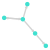
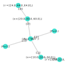

# GraphStorage

[](https://SebastianM-C.github.io/GraphStorage.jl/stable)
[](https://SebastianM-C.github.io/GraphStorage.jl/latest)
[](https://travis-ci.com/SebastianM-C/GraphStorage.jl)
[](https://ci.appveyor.com/project/SebastianM-C/GraphStorage-jl)
[](https://codecov.io/gh/SebastianM-C/GraphStorage.jl)

This is an _experimental_ package for storing hierarchical data in graphs in a non-redundant way.
This package aims to be useful when one has a combination of data and metadata or parameters
and the use of tables would lead to a lot of redundancy in the corresponding columns.

### Introduction

In general a graph is a collection of objects with some relations between them.
If we describe the graph from a mathematical point of view, the objects correspond
to vertices and the relations to edges. Graphs can be represented by diagrams.
For example:

|                 Simple graph            |        Simple directed graph
:----------------------------------------:|:-------------------------------------------:
 | 

If the vertices have a direction, we call them directed graphs. We can use graphs
to store data. To do this we will use a graph and associate metadata to the vertices
and the edges. Each vertex will contain a data point and each edge will have an
id, so that we know how data points are connected. We will call a node a vertex
and its associated metadata and a path will be the collection of all edges with
the same id. For example if we have `x = [1, 2, 3]`, then the graph looks like this:


Now, let's consider that we have a function, say `f(x) = x^2`, and we apply it
to our `x` and want to store the resulting `y = [1, 4, 9]`. We encode
the fact that `y` was derived / computed from `x` by using edges
oriented from the `x` nodes to the `y` nodes. We can compare the
graph and the table representations


|  id   |   x   |   y   |
|-------|-------|-------|
|   1   |   1   |   1   |
|   2   |   2   |   4   |
|   3   |   3   |   9   |

We can see that a row in the table corresponds to a path in the graph and a column
in the table would be the collection of nodes with the same keys.

### Implementation

In this package we use `NamedTuple`s to specify the information contained in the nodes.
If we want to add more than one value corresponding to the same name (or symbol),
we can specify the values as a vector. For example, for generating the above graph
we can use:

```julia
using GraphStorage

g = StorageGraph()
add_derived_values!(g, (x=[1,2,3],), (y=[1,4,9],))
```

Note: `NamedTuple`s with a single element must use a comma.
(`(a=1,)` is not the same as `(a=1)`)

This package used a `MetaDiGraph` from [MetaGraphs.jl](https://github.com/JuliaGraphs/MetaGraphs.jl)
for the graph and metadata. The metadata is stored in dictionaries with the keys
being given by vertices or edges. There are two ways of querying the data in the
graph: by using indexing and by using the relationships with other nodes.

- For the first kind, ~~we must use `indexby(g, :name)` before adding any node identified
by `:name`. This will create an entry in the metaindices of the graph, which is
a dictionary that maps the stored values to the vertex indices. As an example,
to access all the nodes with the name `x` in the above graph we can use
`keys(g[:x])`~~.

- The other way of accessing the data would be by relying on the structure of
the graph. For example we can get the vertex indices of all the neighbors of
a node and use that to get the values. This would be equivalent with a query
based on the parent node. This is useful with more complicated graph structures,
so an example will be provided later.

## Tutorial and motivation

Let us consider that we have some simulation data with the following structure:
* simulation parameters: `P`  which takes a value or each simulation.
* initial conditions: for each `P` we have an algorithm that generates some
initial conditions. The algorithm itself may have parameters.
* simulation results: for each initial conditions the simulation produces some results
(we can think of this as being a function of the initial conditions as illustrated
in the Introduction).

We will now progressively build up the graph. Let's say that the first simulation
has `P=1` and using `"alg1"` we generated some initial conditions (`x`).

```julia
using GraphStorage

g = StorageGraph()

# We can add the nodes one by one
add_nodes!(g, (P=1,)=>(alg="alg1",))
# or in bulk
add_bulk!(g, (P=1,)=>(alg="alg1",), (x=[10., 20., 30.],))
```
Up to this point the graph and the equivalent table are presented below:


| id | P | alg  | x |
|----|---|------|---|
| 1  | 1 |"alg1"|10.|
| 2  | 1 |"alg1"|20.|
| 3  | 1 |"alg1"|30.|

For the initial conditions we used a node for the algorithm (containing the name)
and one for each of the produced values. Next, we will obtain our simulation results
and add them to the graph.
```julia
# retrieve the previously stored initial conditions
x = [g.vprops[v][:data][:x] for v in final_neighborhs(g, (P=1,)=>(alg="alg1",))]
results = simulation(x, alg="alg1")
add_derived_values!(g, ((P=1,),(alg="alg1",)), (x=x,), (r=results,))
```

Here we presented another way of querying the graph. We used the fact
the initial conditions depend on the previously stored parameters
and we retrieved them as the neighbors in the graph.
After this step we have


| id | P | alg  | x | r |
|----|---|------|---|---|
| 1  | 1 |"alg1"|10.|12.|
| 2  | 1 |"alg1"|20.|22.|
| 3  | 1 |"alg1"|30.|32.|

Now consider what would happen if in a second simulation we would have
`P=2`, but still `"alg1"`. As we can see with increasing complexity
the columns corresponding to simulation parameters or metadata would
contain a lot of redundant information. In the graph we can only store
them once and keep track of things through paths. This is the main
motivation for this package.



| id | P | alg  | x | r |
|----|---|------|---|---|
| 1  | 1 |"alg1"|10.|12.|
| 2  | 1 |"alg1"|20.|22.|
| 3  | 1 |"alg1"|30.|32.|
| 4  | 2 |"alg1"|20.|24.|
| 5  | 2 |"alg1"|40.|44.|
| 6  | 2 |"alg1"|60.|64.|
